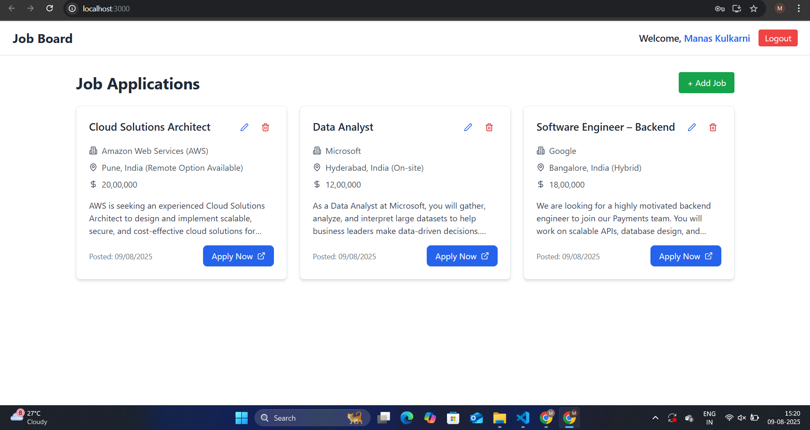
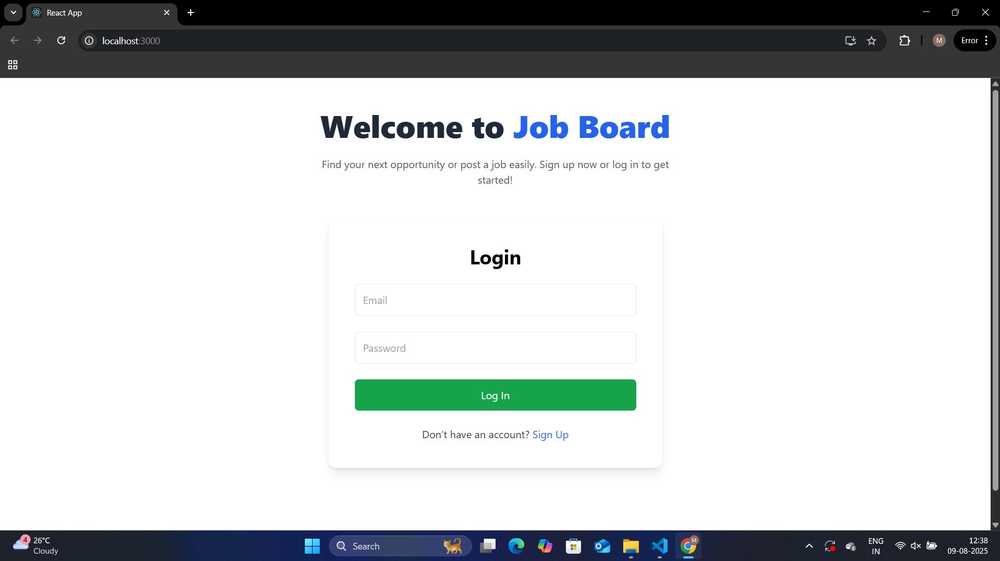

Here’s your **README.md** file ready to copy into your repo:

````markdown
# 📌 Job Board – MERN Stack CRUD App

A simple **Job Board** application built using the **MERN stack**.  
Users can view job postings, add new jobs, edit existing jobs, and delete jobs.

🔗 **Live Demo**: [https://job-board-nine-drab.vercel.app/](https://job-board-nine-drab.vercel.app/)  
📂 **GitHub Repo**: [https://github.com/kulkarnimanas732/Job_Board](https://github.com/kulkarnimanas732/Job_Board)

---

## 🛠 Tech Stack

**Frontend**
- React (Functional Components + Hooks)
- Tailwind CSS

**Backend**
- Node.js
- Express.js
- MongoDB (Mongoose ODM)

---

## ⚙️ Setup & Run Instructions

### 1. Clone the repository
```bash
git clone https://github.com/kulkarnimanas732/Job_Board.git
cd Job_Board
````

### 2. Install dependencies

#### Backend

```bash
cd backend
npm install
```

#### Frontend

```bash
cd ../frontend
npm install
```

### 3. Set up environment variables

In the **backend** folder, create a `.env` file:

```env
MONGO_URI=your_mongodb_connection_string
PORT=5000
JWT_SECRET=your_secret_key
```

### 4. Run the app

#### Backend

```bash
cd backend
npm start
```

#### Frontend

```bash
cd ../frontend
npm start
```

The app will be available at:

* **Frontend:** `http://localhost:3000`
* **Backend:** `http://localhost:5000`

---

## 📸 Screenshots

### 1️⃣ Job Listings Page



### 2️⃣ Add Job Form


### 3️⃣ Edit Job Form


### 4️⃣ Login Page


### 5️⃣ Signup Page
1[Signup](JobBoard/Signup.png)

---


## 📂 Folder Structure

```
Job_Board/
├── backend/       # Node.js + Express + MongoDB API
├── frontend/      # React App
├── JobBoard(Screenshots)/   # Project screenshots (list.png, add.png, edit.png)
└── README.md      # Documentation
```

---

## 👨‍💻 Author

**Manas Kulkarni**
🔗 GitHub: [@kulkarnimanas732](https://github.com/kulkarnimanas732)

```

Once you take the **three screenshots** (list, add, edit), put them inside a `screenshots` folder in your repo, and they’ll automatically appear in GitHub’s README view.
```
